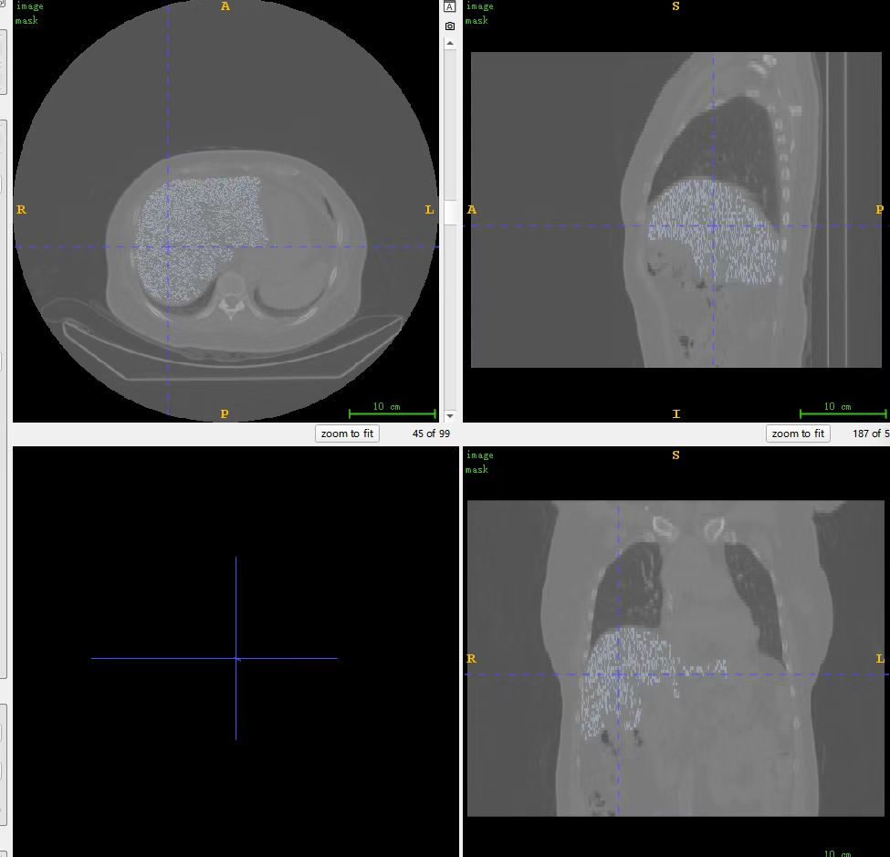

# Liver Segmentation via Region Growing (ITK)

This project implements a **semi-automatic liver segmentation** algorithm on DICOM CT images using [ITK (Insight Toolkit)](https://itk.org/). It uses a **region growing algorithm initialized from a seed point** and enhanced by morphological operations. The final mask preserves organ shape and suppresses artifacts, suitable for clinical preprocessing or downstream AI tasks.

---

<p align="center">
  
  
</p>

## 📌 Key Features

- Semi-automatic: requires a physician-selected seed point
- Supports DICOM 3D image volumes
- Applies region growing + dilation + hole-filling
- Keeps largest component as final mask
- Optional curvature smoothing (not used in final mask)
- Outputs multi-step debug masks for quality inspection

---

## 🧠 Why Semi-Automatic?

Doctors provide a **seed point** (a voxel location) within the liver. This balances:

- **Speed**: auto segmentation completes in seconds
- **Control**: physicians guide the process using domain knowledge

The seed can be selected manually via a 3D viewer or **automatically by computing the center of mass of a rough mask** (see below).

---

## 🔍 Seed Point & Threshold Parameter Origin

The algorithm requires **6 input parameters**:

```
./liver_segmentation_v2.exe <dicom_dir> <seed_x> <seed_y> <seed_z> <lower> <upper>
```

### Parameter Explanation:

| Parameter     | Source                                  | Description                                  |
|---------------|------------------------------------------|----------------------------------------------|
| dicom_dir     | User input                              | Folder containing CT scan in DICOM format     |
| seed_x/y/z    | Physician OR auto-centroid               | A voxel inside the liver                     |
| lower/upper   | Suggested pixel intensity from ITKSNAP or 3Dslcie low and upper +10 | Range of liver intensities (e.g., intensity=83 lower=73 upper=93 ) |

> The `seed_from_mask.cpp` can also be determined using a Python script that computes seed_x/y/z value  the **centroid of a pre-existing binary liver mask**.useg:


## 🧰 Dependencies

- C++17
- ITK 5.4+
- [vcpkg](https://github.com/microsoft/vcpkg) (for dependency management)

vcpkg install itk[vtk]:x64-windows
vcpkg install vtk[qt,interaction,image]:x64-windows
✅ 如果失败可尝试加上 --recurse：
vcpkg install --recurse itk[vtk]:x64-windows

### Install ITK via vcpkg
```bash
git clone https://github.com/Microsoft/vcpkg.git
cd vcpkg
./bootstrap-vcpkg.bat
vcpkg install itk:x64-windows

```

---

## 🛠 Build Instructions
🛠️ 编译项目
CMake build command:
Double-click locally :configure.bat or x64-nativie-commmand-prompt:configure.bat
Windows users are advised to build with PowerShell + Ninja + MSVC

```bash
configure.bat
```

---

## 🚀 Usage

```bash
./liver_segmentation_v2 <dicom_dir> <seed_x> <seed_y> <seed_z> <lower> <upper>
```

### Example:
```bash
./liver_segmentation_v2 ../dataset/CT/ 204 294 42 72 92

if:centroid of a pre-existing binary liver mask
./seed_from_mask. ../dataset/liver.nii/ 
```

---

## 📁 Output

Results are saved to `dataset/result/` and include:

- `image_<timestamp>.nii.gz`: Original CT volume
- `mask_<timestamp>.nii.gz`: Final binary liver mask
- Debug steps:
  - `debug_mask_raw_*.nii.gz`: After region growing
  - `debug_mask_filled_*.nii.gz`: After hole filling
  - `debug_mask_largest_*.nii.gz`: ✅ **Final chosen result**
  - *(smoothing steps were tested but skipped due to artifacts)*

---

## 🎯 Final Result Decision

Although curvature-based smoothing was attempted to reduce jagged boundaries, it introduced **multi-colored edge artifacts** or **hole corruption**. Therefore, the version **after extracting the largest component** (`debug_mask_largest_*.nii.gz`) is selected as the final result.

This ensures:
- Clean mask without holes
- Accurate liver region
- Consistent and reliable boundaries for clinical use

---

## 📊 Evaluation (Optional)

In medical image segmentation, the performance and effect of the Region Growing algorithm based on seed points need to be comprehensively evaluated from three dimensions: clinical applicability, technical indicators and robustness. The following are the specific assessment methods and indicators：

1. Clinical applicability assessment
(1) Subjective evaluation of doctors
Standard: The segmentation results are visually evaluated by radiologists or experts, with a focus on:
Anatomical structure fit degree: Whether the segmentation boundary conforms to the true edge of the lesion/organ (such as the spiny edge of a tumor).
Clinical usability: Whether the segmentation results meet the diagnostic or surgical planning requirements (such as volume measurement, three-dimensional reconstruction).
Tools: Use tools such as ITK-SNAP and 3D Slicer to superimpose the segmentation results with the original image for multi-plane verification.

(2) interactive efficiency
Seed point sensitivity: The robustness of an algorithm to the position of seed points (whether slight movement of seed points leads to significant changes in the results)。

Manual correction volume: The proportion of areas that doctors need to manually correct (the less correction, the better the algorithm)。

2. Quantification of technical indicators
(1) Segmentation accuracy index
Gold standard comparison: Comparison with the Ground Truth (GT) manually marked by experts：

Dicecoefficient（Dice Similarity Coefficient, DSC）：∣
DSC= 
∣A∣+∣B∣
2∣A∩B∣
​The range is [0,1]. The closer it is to 1, the higher the overlap with GT (>0.7 is usually acceptable).
If you have a ground truth mask, consider using metrics like:

- Dice Similarity Coefficient (DSC)
- Jaccard Index (IoU)
- Hausdorff Distance
- Average Symmetric Surface Distance

-  Dice:  0.8105
-  IoU:   0.6814
-  HD95:  12.41
-  ASD:   3.98

An optional Python script can be provided upon request.

---

## 📌 License

MIT License. Intended for research and academic purposes.


